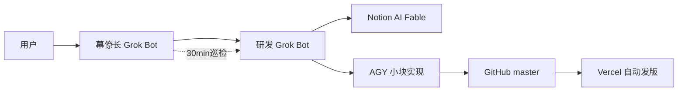

# Two-Minute TD · 两分钟塔防

> **这不只是一个丑丑的小塔防——它是一次可玩的多 Agent 实验记录。**

**在线试玩：** https://two-minute-td.vercel.app

用 **Grok Bot 双席**（幕僚长 + 研发）+ **Notion AI（Fable）** + **AGY** 一天做出可玩塔防并上线 Vercel。公开检索未见同款组合，故记入仓库。

完整回顾 → [docs/BUILD_STORY.md](./docs/BUILD_STORY.md)

## 流水线示意

| 席位 | 职责 |
|------|------|
| 幕僚长 | 对接、巡检、解卡、代 push |
| 研发 | Fable 细排 → 拆块 → AGY → 验收 |
| Notion AI Fable | 云端模型做计划 |
| AGY | 小块代码 |
| Vercel | master push 发版 |

## 游戏本身

单路 S 路径；箭/炮/冰；小兵/疾行/重甲；六波约两分钟。UI 很丑——重点在流水线。

## Setup

Install deps, then run the Vite dev server or production build (see package scripts).
